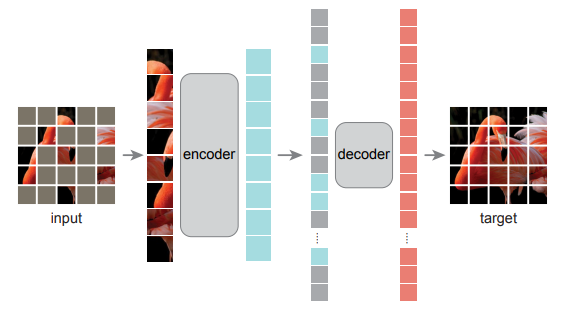

# An pytorch implementation of [Masked Autoencoders Are Scalable Vision Learners](https://arxiv.org/abs/2111.06377)

This is a coarse version for MAE, only make the pretrain model, the finetune and linear is comming soon.

**Note: My vit code not fully base on the Timm or BEIT, so the result may be less than them.**

## Update
- **2021-12-03**: Add the Vit-base/16 pretrain model.


### 1. Introduction
This repo is the MAE-vit model which impelement with pytorch, no reference any reference code so this is a non-official version. Because of the limitation of time and machine, I only trained the vit-tiny, vit-base/16 for model pretrain.


### 2. Enveriments
- python 3.7+
- pytorch 1.7.1 
- pillow
- timm  
- opencv-python

### 3. Model Config

#### Pretrain Config

- **BaseConfig**
    ```python
    img_size = 224,
    patch_size = 16,
    ```
- **EncoderConfig**

    |Encoder|dims|depth|heads|mask|
    |:---:|:---:|:---:|:---:|:---:|
    |VIT-TINY/16|192|12|3|0.75|
    |VIT-Base/16|768|12|12|0.75|


- **DecoderConfig**
    
    |Decoder|dims|depth|heads|mask|
    |:---:|:---:|:---:|:---:|:---:|
    |VIT-TINY/16|512|8|16|0.75|
    |VIT-Base/16|512|8|16|0.75|
    
- **Mask**
    1. We use the shuffle patch after Sin-Cos position embeeding for encoder.(May be mask on the input image also is ok)
    2. Mask the shuffle patch, keep the mask index.
    3. Unshuffle the mask patch and combine with the encoder output embeeding before the position embeeding for decoder.
    4. Restruction decoder embeeidng by TransposeConvolution(Paper is reshape, but i thought reshape is not match with conv patch embeeding).
    5. Build the mask map with mask index for cal the L2 loss(only consider the mask patch).

#### Finetune Config
Wait for the results

TODO:
- [ ] Finetune Trainig
- [ ] Linear Training 

### 4. Results

Show the pretrain result on the imaget val dataset, left is the mask image, middle is the reconstruction image, right is the origin image.

- **VIT-tiny/16**

- **VIT-Base/16**


Large models work significantly better than small models. 

- **weights**
    - **pretrian**
        
        Vit-Tiny/16 pretrain models is [here](https://drive.google.com/file/d/1I0EzCLYLmHBfhIaESFvWGlhuQuJ8xPw6/view?usp=sharing)
        
        Vit-Base/16 pretrain models is [here](https://drive.google.com/file/d/1wxSNfWDbLCoSMelZCo1uj6MXcHDd8G0b/view?usp=sharing)
    - **training from strach**
        
        Trainig the raw vit from strach follow kaiming paper config, but not use the EMA for vit-base.And use the sin-cos position embeeding replace the learnable position embeeding.
        Vit-Base/16 strach model is [here](https://drive.google.com/file/d/1kn0AqH2TB59DBfgH3mnKlsCSIx4UVFaz/view?usp=sharing), top-1 acc is **81.182%**, paper is **82.3%** with EMA. 
    

You can download to test the restruction result. Put the ckpt in ```weights``` folder.


### 5. Training & Inference
- **Dataset prepare**
    ```
    /data/home/imagenet/xxx.jpeg, 0
    /data/home/imagenet/xxx.jpeg, 1
    ...
    /data/home/imagenet/xxx.jpeg, 999
    ```
- **Training**
    1. Pretrain
        - Vit-tiny
            ```bash
            #!/bin/bash
            OMP_NUM_THREADS=1
            MKL_NUM_THREADS=1
            export OMP_NUM_THREADS
            export MKL_NUM_THREADS
            cd MAE-Pytorch;
            CUDA_VISIBLE_DEVICES=0,1,2,3,4,5,6,7 python -W ignore -m torch.distributed.launch --nproc_per_node 8 train_mae.py \
            --batch_size 256 \
            --num_workers 32 \
            --lr 1.5e-4 \
            --optimizer_name "adamw" \
            --cosine 1 \
            --max_epochs 300 \
            --warmup_epochs 40 \
            --num-classes 1000 \
            --crop_size 224 \
            --patch_size 16 \
            --color_prob 0.0 \
            --calculate_val 0 \
            --weight_decay 5e-2 \
            --finetune 0 \
            --lars 0 \
            --mixup 0.0 \
            --smoothing 0.0 \
            --train_file $train_file \
            --val_file $val_file \
            --checkpoints-path $ckpt_folder \
            --log-dir $log_folder
            ```
        - Vit-Base
            ```bash
            #!/bin/bash
            OMP_NUM_THREADS=1
            MKL_NUM_THREADS=1
            export OMP_NUM_THREADS
            export MKL_NUM_THREADS
            cd MAE-Pytorch;
            CUDA_VISIBLE_DEVICES=0,1,2,3,4,5,6,7 python -W ignore -m torch.distributed.launch --nproc_per_node 8 train_mae.py \
            --batch_size 256 \
            --num_workers 32 \
            --lr 1.2e-3 \
            --optimizer_name "adamw" \
            --cosine 1 \
            --max_epochs 400 \
            --warmup_epochs 40 \
            --num-classes 1000 \
            --crop_size 224 \
            --patch_size 16 \
            --color_prob 0.0 \
            --calculate_val 0 \
            --weight_decay 5e-2 \
            --finetun 0 \
            --lars 0 \
            --mixup 0.0 \
            --smoothing 0.0 \
            --train_file $train_file \
            --val_file $val_file \
            --checkpoints-path $ckpt_folder \
            --log-dir $log_folder
            ```

    2. Finetune
    TODO:
        - [ ] training
    3. Linear
    TODO:
        - [ ] training


- **Inference**
    1. pretrian
    ```python
    python mae_test.py --test_image xxx.jpg --ckpt weights/weights.pth
    ```
    2. classification
    ```python
    python inference.py --test_file val_imagenet.log --ckpt weights/weights.pth
    ```

### 6. TODO
- [x] VIT-BASE model training.
- [ ] SwinTransformers for MAE.
- [ ] Finetune & Linear training.

Finetune is trainig, the weights may be comming soon. There may be have some problems with the implementation, welcome to make discussion and submission code.


