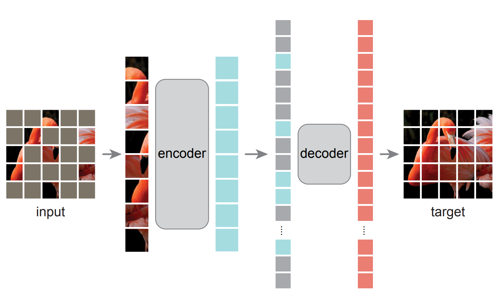

# An pytorch implementation of [Masked Autoencoders Are Scalable Vision Learners](https://arxiv.org/abs/2111.06377)

This is a coarse version for MAE, only make the pretrain model, the finetune and linear is comming soon.


### 1. Introduction
This repo is the MAE-vit model which impelement with pytorch, no reference any reference code so this is a non-official version. Because of the limitation of time and machine, I only trained the vit-tiny model for encoder.


### 2. Enveriments
- python 3.7+
- pytorch 1.7.1 
- pillow
- timm  
- opencv-python

### 3. Model Config

#### Pretrain Config

- **BaseConfig**
    ```python
    img_size = 224,
    patch_size = 16,
    ```
- **Encoder**
    The encoder if follow the Vit-tiny model config
    ```python
    encoder_dim = 192,
    encoder_depth = 12,
    encoder_heads = 3,
    ```
- **Decoder**
    The decoder is followed the kaiming paper config.
    ```python
    decoder_dim = 512,
    decoder_depth = 8,
    decoder_heads = 16, 
    ```
- **Mask**
    1. We use the shuffle patch after Sin-Cos position embeeding for encoder.
    2. Mask the shuffle patch, keep the mask index.
    3. Unshuffle the mask patch and combine with the encoder embeeding before the position embeeding for decoder.
    4. Restruction decoder embeeidng by convtranspose.
    5. Build the mask map with mask index for cal the loss(only consider the mask patch).

#### Finetune Config
Wait for the results

TODO:
- [ ] Finetune Trainig
- [ ] Linear Training 

### 4. Results

Restruction the imagenet validation image from pretrain model, compare with the **kaiming results**, restruction quality is less than he. 
May be the encoder model is too small TT.

The Mae-Vit-tiny pretrain models is [here](https://drive.google.com/file/d/1I0EzCLYLmHBfhIaESFvWGlhuQuJ8xPw6/view?usp=sharing), you can download to test the restruction result. Put the ckpt in ```weights``` folder.


### 5. Training & Inference
- dataset prepare
    ```
    /data/home/imagenet/xxx.jpeg, 0
    /data/home/imagenet/xxx.jpeg, 1
    ...
    /data/home/imagenet/xxx.jpeg, 999
    ```
- Training 
    1. Pretrain 
        ```bash
        #!/bin/bash
        OMP_NUM_THREADS=1
        MKL_NUM_THREADS=1
        export OMP_NUM_THREADS
        export MKL_NUM_THREADS
        cd MAE-Pytorch;
        CUDA_VISIBLE_DEVICES=0,1,2,3,4,5,6,7 python -W ignore -m torch.distributed.launch --nproc_per_node 8 train_mae.py \
        --batch_size 256 \
        --num_workers 32 \
        --lr 1.5e-4 \
        --optimizer_name "adamw" \
        --cosine 1 \
        --max_epochs 300 \
        --warmup_epochs 40 \
        --num-classes 1000 \
        --crop_size 224 \
        --patch_size 16 \
        --color_prob 0.0 \
        --calculate_val 0 \
        --weight_decay 5e-2 \
        --lars 0 \
        --mixup 0.0 \
        --smoothing 0.0 \
        --train_file $train_file \
        --val_file $val_file \
        --checkpoints-path $ckpt_folder \
        --log-dir $log_folder
        ```
    
    2. Finetune
    TODO:
        - [ ] training
    3. Linear
    TODO:
        - [ ] training


- Inference
    1. pretrian
    ```python
    python mae_test.py --test_image xxx.jpg --ckpt weights.pth
    ```
    2. classification
    TODO:
        - [ ] training

### 6. TODO
- [ ] VIT-BASE model training.
- [ ] SwinTransformers for MAE.
- [ ] Finetune & Linear training.

Finetune is trainig, the weights may be comming soon.


